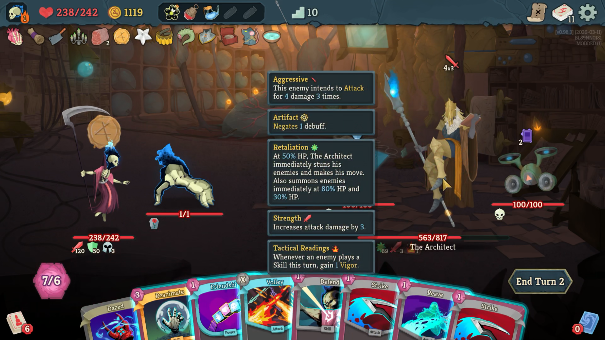

# Act 4: Final Ascent

<p align="center">
  
</p>

<p align="center">
  <strong>An unofficial Slay the Spire 2 fan mod that adds a full custom Act 4 route, reward events, map flow, multiplayer support work, and the Architect boss encounter.</strong>
</p>

<p align="center">
  Open source source pack for modders who want to study it, build it, tune it, or branch it.
</p>

<p align="center">
  <a href="https://www.nexusmods.com/slaythespire2/mods/37">NexusMods Page</a>
</p>

---

## Highlights

- Custom Act 4 flow built around a short endgame route
- New reward events including the Grand Library and tome choice system
- Large custom Architect boss fight with multi-phase behavior, summons, powers, and VFX
- Harmony-based runtime hooks plus regular gameplay systems in C#
- Public source pack for learning, modding, and iteration

## Project Snapshot

| Item | Details |
| --- | --- |
| Engine | `Godot 4.5 Mono` |
| Language | `C#` + Godot pack assets |
| Platform | Windows |
| Build Script | `build_mod.ps1` |
| Main Source | `src/Act4Placeholder/` |
| Main Assets | `pack/` |
| Outputs | `dll`, `pck`, `zip` |

> [!NOTE]
> The internal source folder still uses the name `Act4Placeholder` for compatibility with the existing mod structure.

## Asset Notice

- Slay the Spire 2 and its original game assets remain the property of Mega Crit.
- This repository is an unofficial fan mod project and is not affiliated with or endorsed by Mega Crit.
- The MIT license in this repository applies to this mod's source code and original mod-created content only.
- Any bundled game-derived assets, trademarks, logos, or other Slay the Spire 2 property remain under their original ownership and are not re-licensed by this repository.

## AI Assistance Disclaimer

> Disclaimer: This mod was developed in about 3 weeks and contains roughly 17,225 lines of C# source code. In order for this to be feasible, GitHub Copilot AI helped speed up codebase navigation by identifying useful Godot and Slay the Spire 2 APIs, and greatly assisted with repetitive snippets such as localization setup.

---

## English

### What This Repo Contains

This repository is the public source pack for `Act 4: Final Ascent`.
It includes:

- gameplay code
- Harmony patches
- Godot-side assets and pack content
- localization files
- build scripts for generating the mod package

### Requirements

- Windows
- PowerShell
- `.NET SDK` installed and available on `PATH`
- `Godot 4.5 Mono` installed
- `Slay the Spire 2` installed locally

### Repository Layout

| Path | Purpose |
| --- | --- |
| `src/Act4Placeholder/` | C# source |
| `pack/` | Godot project, assets, localization, pack data |
| `build_mod.ps1` | Main build script |
| `artifacts/` | Build output |

### Build

Run this from the repo root:

```powershell
powershell -ExecutionPolicy Bypass -File .\build_mod.ps1
```

### Custom Game Path

If the game is not in a standard location, set `STS2_GAME_DIR` to the game's `data_sts2_windows_x86_64` folder first.

```powershell
$env:STS2_GAME_DIR = "C:\Path\To\Slay the Spire 2\data_sts2_windows_x86_64"
powershell -ExecutionPolicy Bypass -File .\build_mod.ps1
```

Optional fallback override:

```powershell
$env:STS2_ASSET_ROOT = "C:\Path\To\Extracted\Slay the Spire 2"
powershell -ExecutionPolicy Bypass -File .\build_mod.ps1
```

### Build Output

- `artifacts/Act4FinalAscent.dll`
- `artifacts/Act4FinalAscent.pck`
- `artifacts/Act4FinalAscent.zip`

### Where To Edit

- Boss logic: `src/Act4Placeholder/Architect/`
- Rewards and events: `src/Act4Placeholder/Rewards/`
- Patches, UI, and map flow: `src/Act4Placeholder/Patches/`, `src/Act4Placeholder/UI/`, `src/Act4Placeholder/Map/`
- Localization: `pack/Act4Placeholder/localization/`
- Images and assets: `pack/images/` and `pack/Act4Placeholder/`

### How The Mod Is Put Together

- `Harmony patches` hook Slay the Spire 2 runtime behavior.
- The main Harmony entry point is `src/Act4Placeholder/Core/ModEntry.cs`.
- Most gameplay hooks live in `src/Act4Placeholder/Patches/`.
- Larger gameplay systems are regular C# classes, not just Harmony patches:
  - `Architect/` for the boss, summons, and powers
  - `Rewards/` for Act 4 events and reward flows
  - `UI/` for menu, save-sync, and custom screens
  - `Map/` for Act 4 route generation
- Godot-side content lives in `pack/`:
  - textures, atlases, audio, VFX scenes, localization, and pack metadata

### Suggested Reading Order

1. `src/Act4Placeholder/Core/ModEntry.cs`
2. `src/Act4Placeholder/Patches/`
3. `src/Act4Placeholder/Architect/Act4ArchitectBoss.cs`
4. `src/Act4Placeholder/Architect/Act4ArchitectBossStateMachine.cs`

### Notes

- Godot version matters, use `Godot 4.5 Mono`.
- The repo is meant to be practical to mod, not overly abstract, so some systems stay close to the game flow on purpose.

---

## 中文

### 项目简介

这个仓库是 `Act 4: Final Ascent` 的公开源码包。
其中包含：

- 游戏逻辑代码
- Harmony 补丁
- Godot 侧资源与打包内容
- 本地化文件
- 用于生成模组包的构建脚本

### AI 辅助声明

> 免责声明：本模组大约在 3 周内完成开发，目前包含约 17,225 行 C# 源代码。为了让这样的开发周期成为可能，GitHub Copilot AI 帮助加快了代码库导航，协助识别有用的 Godot 与 Slay the Spire 2 API，并在本地化这类重复性代码片段上提供了很大帮助。

### 环境需求

- Windows
- PowerShell
- 已安装并可在 `PATH` 中使用的 `.NET SDK`
- `Godot 4.5 Mono`
- 本地已安装 `Slay the Spire 2`

### 仓库结构

| 路径 | 作用 |
| --- | --- |
| `src/Act4Placeholder/` | C# 源码 |
| `pack/` | Godot 工程、资源、本地化、打包数据 |
| `build_mod.ps1` | 主构建脚本 |
| `artifacts/` | 构建产物 |

### 构建方法

在仓库根目录运行：

```powershell
powershell -ExecutionPolicy Bypass -File .\build_mod.ps1
```

### 自定义游戏路径

如果游戏不在默认位置，先把 `STS2_GAME_DIR` 设为游戏的 `data_sts2_windows_x86_64` 目录。

```powershell
$env:STS2_GAME_DIR = "C:\Path\To\Slay the Spire 2\data_sts2_windows_x86_64"
powershell -ExecutionPolicy Bypass -File .\build_mod.ps1
```

可选的兜底覆盖：

```powershell
$env:STS2_ASSET_ROOT = "C:\Path\To\Extracted\Slay the Spire 2"
powershell -ExecutionPolicy Bypass -File .\build_mod.ps1
```

### 构建产物

- `artifacts/Act4FinalAscent.dll`
- `artifacts/Act4FinalAscent.pck`
- `artifacts/Act4FinalAscent.zip`

### 常见修改位置

- Boss 逻辑：`src/Act4Placeholder/Architect/`
- 奖励与事件：`src/Act4Placeholder/Rewards/`
- Patch、UI、地图流程：`src/Act4Placeholder/Patches/`、`src/Act4Placeholder/UI/`、`src/Act4Placeholder/Map/`
- 本地化：`pack/Act4Placeholder/localization/`
- 图片与资源：`pack/images/` 与 `pack/Act4Placeholder/`

### 这个模组大致是怎么做的

- 主要通过 `Harmony 补丁` 挂接 Slay the Spire 2 的运行时逻辑。
- Harmony 的主入口在 `src/Act4Placeholder/Core/ModEntry.cs`。
- 大部分和游戏本体交互的挂钩逻辑都在 `src/Act4Placeholder/Patches/`。
- 体量较大的自定义系统不是只有 Harmony 补丁，还包括普通 C# 类：
  - `Architect/`：建筑师 Boss、本体机制、召唤物、能力
  - `Rewards/`：第四幕事件与奖励流程
  - `UI/`：菜单、存档同步、自定义界面
  - `Map/`：第四幕地图与路线生成
- Godot 侧内容放在 `pack/`：
  - 图片、图集、音频、特效场景、本地化、打包元数据

### 建议阅读顺序

1. `src/Act4Placeholder/Core/ModEntry.cs`
2. `src/Act4Placeholder/Patches/`
3. `src/Act4Placeholder/Architect/Act4ArchitectBoss.cs`
4. `src/Act4Placeholder/Architect/Act4ArchitectBossStateMachine.cs`

### 说明

- Godot 版本要对，建议直接用 `Godot 4.5 Mono`。
- 仓库尽量保持实用和易改，所以有些系统会刻意贴近游戏实际流程，而不是为了形式上“更抽象”去过度包装。
- 内部源码目录仍保留 `Act4Placeholder` 名称，这是兼容性需要。

---

## Links

- NexusMods: https://www.nexusmods.com/slaythespire2/mods/37
